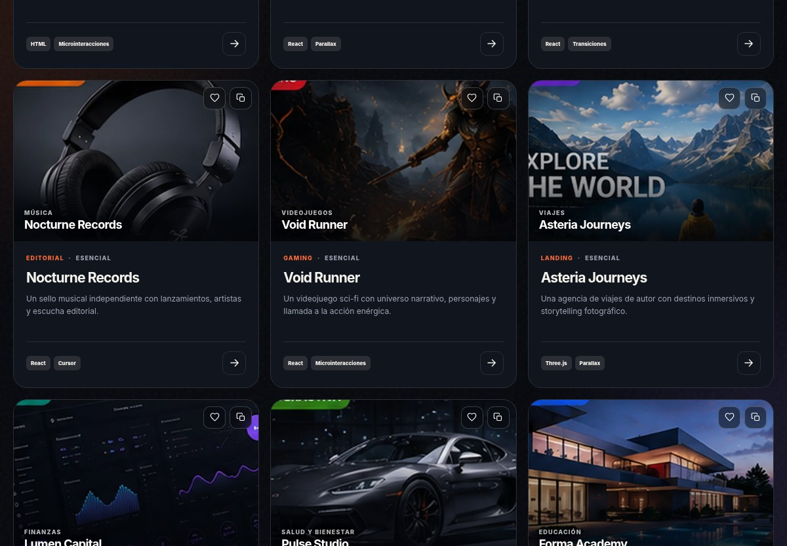

# Motion 404 — Prompt Studio

**Versión 1.2.1** · Aplicación web estática y PWA para explorar, adaptar, generar, guardar y exportar prompts profesionales destinados a crear webs y aplicaciones animadas con asistentes de IA.



## Abrir en Windows

La opción recomendada es hacer doble clic en **`ABRIR-MOTION-404.bat`**. El lanzador:

1. Detecta Python mediante `py -3` o `python`.
2. Busca un puerto libre a partir del 4040.
3. Inicia un servidor local y comprueba que responde.
4. Abre la aplicación en el navegador.
5. Si el servidor no puede arrancar, abre la versión portátil.

El servidor permanece activo en una ventana minimizada llamada **Motion 404 Server**. Ciérrala cuando termines.

Para abrir sin instalar nada, usa **`Motion-404-PORTABLE.html`**. Es un único archivo generado desde el código principal, con CSS y JavaScript integrados y una CSP basada en hashes. La instalación PWA y el Service Worker requieren `localhost` o HTTPS.

También puede abrirse `index.html` directamente después de extraer todo el ZIP. Los recursos deben conservar su estructura de carpetas.

## Funciones reales

- Catálogo local de 180 prompts creados a partir de 30 conceptos y seis variantes técnicas.
- Búsqueda, categorías, filtros por stack y complejidad, orden y selección aleatoria.
- Favoritos y prompts personalizados persistidos en `localStorage` cuando el navegador lo permite.
- Generador configurable por sector, tipo de producto, estilo, movimiento, stack y funciones.
- Copia, descarga Markdown, exportación e importación JSON.
- Validación, normalización y recuperación de datos locales dañados o incompatibles.
- Confirmación antes de sustituir datos mediante importación.
- Borrado de favoritos, prompts y preferencias desde la propia interfaz.
- Tema oscuro y claro, color de interfaz sincronizado y contraste de texto corregido.
- Manifest, Service Worker, caché offline y rutas relativas preparados para GitHub Pages. La instalación y el modo offline deben validarse en la URL publicada.
- El botón de instalación solo aparece cuando el navegador confirma que la PWA puede instalarse.
- Cachés aisladas para no borrar datos offline de otras aplicaciones publicadas bajo el mismo dominio de GitHub Pages.
- Sin cuentas, backend, telemetría, cookies de seguimiento ni dependencias externas en producción.

## Estructura

```text
Motion-404/
├── assets/
│   ├── icons/
│   └── preview.jpg
├── tests/
│   ├── functional_audit.py
│   ├── portable_smoke.py
│   ├── smoke.py
│   └── static_check.py
├── tools/
│   └── build_portable.py
├── ABRIR-MOTION-404.bat
├── Motion-404-PORTABLE.html
├── app.js
├── index.html
├── styles.css
├── manifest.webmanifest
├── sw.js
├── README.md
├── CHANGELOG.md
├── QA-REPORT.md
├── AUDITORIA-PROFESIONAL-v1.2.1.md
└── LICENSE
```

## Ejecutar en local

```bash
python -m http.server 8080 --bind 127.0.0.1
```

Abre `http://127.0.0.1:8080/`.

## Pruebas

Instala las dependencias de desarrollo cuando sea necesario:

```bash
python -m pip install -r requirements-dev.txt
playwright install chromium
```

Ejecuta:

```bash
python tools/build_portable.py --check
python tests/static_check.py
python tests/portable_smoke.py
python tests/functional_audit.py
python tests/smoke.py
```

`functional_audit.py` cubre búsqueda, filtros, todos los botones principales, persistencia simulada, recuperación de datos corruptos, copia y fallback, diálogos, teclado, foco, generador, importación, exportación, borrado, tema, instalación simulada, 320 px, ausencia de JavaScript y movimiento reducido. `smoke.py` necesita navegación HTTP local y añade comprobaciones de Service Worker y offline.

Para regenerar el archivo autónomo después de modificar HTML, CSS o JavaScript:

```bash
python tools/build_portable.py
```

## Publicar en GitHub Pages

1. Crea un repositorio, por ejemplo `Motion-404`.
2. Sube el contenido de esta carpeta a la rama principal.
3. En **Settings → Pages**, selecciona **Deploy from a branch**.
4. Elige la rama principal y la carpeta `/ (root)`.
5. Abre la URL publicada y ejecuta una recarga forzada para evitar cachés de versiones anteriores.

La aplicación utiliza rutas relativas, `start_url: "./"`, `scope: "./"` e identificador PWA relativo, por lo que está preparada para una subruta como `https://usuario.github.io/Motion-404/`.

## Datos y privacidad

La aplicación procesa los prompts en el navegador. Favoritos, tema y creaciones se guardan en `localStorage`; no se transmiten a servidores. El usuario puede exportar, importar y borrar los datos desde la interfaz. La importación limita tamaño y cantidad, normaliza campos y escapa los valores mostrados.

## Limitaciones conocidas

- La instalación PWA requiere HTTPS o `localhost`.
- La publicación real en GitHub Pages debe validarse después de subir el proyecto.
- El E2E HTTP y el Service Worker no pudieron ejecutarse en el entorno de auditoría porque Chromium bloqueó `127.0.0.1` mediante una política administrativa; el servidor y los tipos MIME sí se validaron con peticiones HTTP directas.
- Safari, Firefox, iPhone, iPad y Android requieren una matriz manual adicional.
- La versión portátil no puede ofrecer Service Worker ni instalación PWA por las restricciones de `file://`.
- Los 180 prompts son combinaciones originales estructuradas a partir de 30 conceptos; no son 180 briefings completamente independientes escritos uno a uno.

## Autoría

Motion 404 es un producto original del ecosistema Universo 404. No está afiliado a MotionSites y no copia ni redistribuye sus prompts premium, marca, vídeos o recursos visuales.
